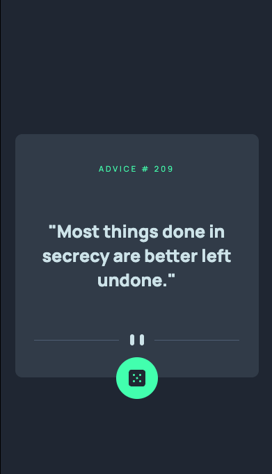

# Advice generator app 

This is my solution to the [Advice generator app challenge on Frontend Mentor](https://www.frontendmentor.io/challenges/advice-generator-app-QdUG-13db). 

## Table of contents

- [Advice generator app](#advice-generator-app)
  - [Table of contents](#table-of-contents)
  - [Overview](#overview)
    - [The challenge](#the-challenge)
    - [Screenshot](#screenshot)
    - [Links](#links)
  - [My process](#my-process)
    - [Built with](#built-with)
  - [Author](#author)

## Overview

### The challenge

Users should be able to:

- View the optimal layout for the app depending on their device's screen size
- See hover states for all interactive elements on the page
- Generate a new piece of advice by clicking the dice icon

### Screenshot

### Links

- Solution URL: [GitHub](https://github.com/Kevin27j/advice-generator-app)
- Live Site URL: [Live](https://kevin27j.github.io/advice-generator-app/)

## My process

### Built with

- HTML5
- CSS 
- Flexbox
- Mobile-first workflow
- [Advice Slip JSON API](https://api.adviceslip.com/#object-slip) - JS API

## Author

- Website - (https://kevin27j.github.io/Bootstrap-Portfolio/)
- Frontend Mentor - [@Kevin27j](https://www.frontendmentor.io/profile/Kevin27j)